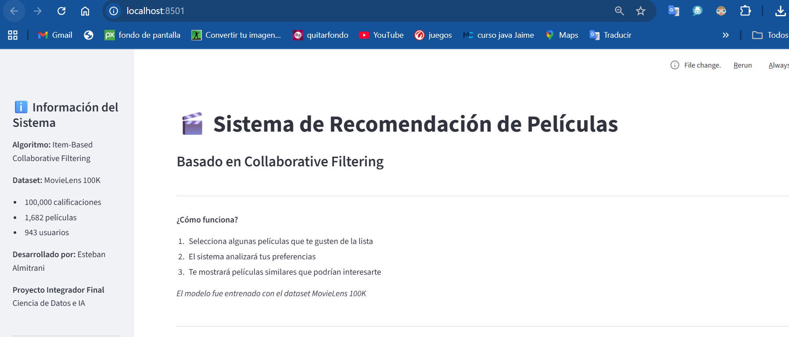
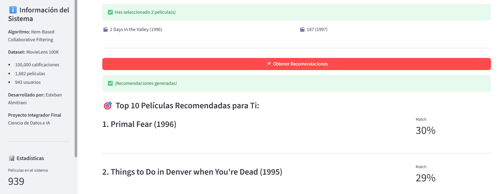

# 🎬 Sistema de Recomendación de Películas

Sistema inteligente de recomendación de películas utilizando algoritmos de Collaborative Filtering y Machine Learning.

## 📋 Descripción

Este proyecto implementa un sistema de recomendación que analiza preferencias de usuarios y calificaciones históricas para sugerir películas personalizadas.

## 🎯 Objetivos

- Aplicar algoritmos de Machine Learning para sistemas de recomendación
- Desarrollar una solución escalable y profesional
- Demostrar conocimientos en Ciencia de Datos e Inteligencia Artificial
- Implementar metodologías ágiles en el desarrollo

## 🛠️ Tecnologías Utilizadas

- **Python 3.x**
- **Pandas & NumPy** - Manipulación de datos
- **Scikit-learn** - Modelos de Machine Learning
- **Matplotlib & Seaborn** - Visualizaciones
- **Streamlit** - Interfaz web interactiva
- **Jupyter Notebook** - Análisis y desarrollo
- **Git & GitHub** - Control de versiones

## 📊 Dataset

**MovieLens 100K**

- 100,000 calificaciones
- 1,682 películas
- 943 usuarios
- Fuente: [GroupLens](https://grouplens.org/datasets/movielens/)

## 📁 Estructura del Proyecto

```
sistema-recomendacion-peliculas/
├── data/
│   ├── raw/              # Datos originales
│   └── processed/        # Datos procesados
├── notebooks/            # Jupyter notebooks
├── src/                  # Código fuente
├── docs/                 # Documentación
├── images/              # Imágenes y gráficos
├── requirements.txt     # Dependencias
└── README.md           # Este archivo
```

## 🚀 Instalación

### Requisitos previos

- Python 3.8 o superior
- pip

## 🧪 Testing

Para probar el sistema de recomendación:
```python
# En notebooks/03_modelo_recomendacion.ipynb
# Ejecutar todas las celdas para ver ejemplos de recomendaciones
```

## 📈 Métricas del Modelo

- **Algoritmo:** Item-Based Collaborative Filtering
- **Similitud:** Cosine Similarity
- **Películas procesadas:** 939
- **Cobertura:** ~56% del catálogo original

### Pasos

1. Clonar el repositorio:

```bash
git clone https://github.com/estebanalmitrani/sistema-recomendacion-peliculas.git
cd sistema-recomendacion-peliculas
```

2. Instalar dependencias:

```bash
pip install -r requirements.txt
```

3. Descargar el dataset MovieLens 100K y colocarlo en `data/raw/`

## 📈 Resultados

### Análisis Exploratorio
- ✅ 100,000 calificaciones analizadas
- ✅ 1,682 películas en el catálogo
- ✅ 943 usuarios en el dataset
- ✅ Calificación promedio: 3.5/5
- ✅ Dataset limpiado y preparado

### Modelo de Recomendación
- ✅ Algoritmo: Item-Based Collaborative Filtering
- ✅ Matriz de similitud: 939 películas
- ✅ Sistema de recomendación funcional

### Aplicación Web
- ✅ Interfaz interactiva con Streamlit
- ✅ Selector de películas favoritas
- ✅ Recomendaciones personalizadas en tiempo real
- ✅ Visualización de scores de similitud

## 🚀 Cómo Usar la Aplicación

### Ejecutar la app:
```bash
cd src
streamlit run app.py
```

### Usar el sistema:
1. Selecciona tus películas favoritas del menú desplegable
2. Click en "Obtener Recomendaciones"
3. Explora las películas recomendadas con su porcentaje de match

## 📊 Capturas de Pantalla

### Interfaz Principal


### Recomendaciones


## 🎓 Metodología

Este proyecto fue desarrollado siguiendo metodología ágil:
- **Sprint 1:** Análisis y limpieza de datos
- **Sprint 2:** Desarrollo del modelo de ML
- **Sprint 3:** Creación de interfaz web
- **Sprint 4:** Documentación y presentación

Gestión del proyecto realizada con Notion (Kanban board).

## 👤 Autor

**Esteban Almitrani**

- Proyecto Integrador Final
- Ciencia de Datos e Inteligencia Artificial
- Noviembre 2024

## 📄 Licencia

Este proyecto está bajo la Licencia MIT - ver el archivo [LICENSE](LICENSE) para más detalles.

## 🙏 Agradecimientos

- Dataset proporcionado por GroupLens Research
- Comunidad de Data Science por recursos y tutoriales

---

